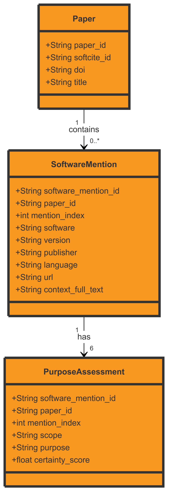

# software-mentions-dataset-analysis
Analyses of software mentions and dependencies

## What this dataset is

The software-mentions dataset is a collection of ML-identified mentions of software
detected in about 24,000,000 academic papers.

### The data model

A __paper__ can contain many __mentions__, each of which was found in a full-text snippet of __context__, and extracts the (raw and normalized) __software name__ , __version number__, __creator__, __url__, as well as associated __citation__ to the reference list of the paper.

Each __mention__ has multiple __purpose assessments__ about the relationship between the software and the paper: Was the software __used__ in the research?, Was it __created__ in the course of the research?, Was the software __shared__ alongside this paper? These probabilistic assessments (0..1 range) are made in two ways: using only the information from the specific mention and using all the mentions within a single paper together (mention-level vs document-level); thus each mention has six __purpose assessments__.



## Getting Started

### Getting the Parquet files

If you want to extract the .parquet tables yourself, or work with the original dataset, see [Extracting Tables](EXTRACTING_TABLES.md).
Otherwise, you can download the tables in a friendlier format from (INSERT LOCATION).

### Example Analyses

For these examples, the 5% subset of the data is used.
These examples require the `tidyverse` and `arrow` packages to run, but should otherwise work as-is.

1. How many papers mention OpenStreetMap?

This example filters by `software_normalied` as this is less noisy than `software_raw`.

```R
> mentions <- open_dataset("/home/willbeason/Downloads/mentions.pdf_1.parquet")
> mentions |>
+   filter(software_normalized == "OpenStreetMap") |>
+   select(paper_id) |>
+   distinct() |>
+   count() |>
+   collect()
# A tibble: 1 × 1
      n
  <int>
1   376
```

2. How did the number of papers referencing STATA each year change from 2000-2020?

By joining the Mentions table with Papers, we can compute statistics requiring access to paper metadata. Analyses like these are why we include fields such as `paper_id` in Mentions, even though it denormalizes the tables.

```R
> papers <- open_dataset("/home/willbeason/Downloads/papers_1.parquet")
> mentions <- open_dataset("/home/willbeason/Downloads/mentions.pdf_1.parquet")
> 
> mentions |>
+   filter(software_normalized == "STATA") |>
+   select(paper_id) |>
+   distinct() |>
+   inner_join(papers, by = c("paper_id")) |>
+   filter(published_year >= 2000, published_year <= 2020) |>
+   count(published_year) |>
+   arrange(published_year) |>
+   collect()
# A tibble: 21 × 2
   published_year     n
            <int> <int>
 1           2000    11
 2           2001    14
 3           2002    20
 4           2003    29
 5           2004    51
 6           2005    32
 7           2006    42
 8           2007    49
 9           2008    77
10           2009    87
# ℹ 11 more rows
# ℹ Use `print(n = ...)` to see more rows
```

3. What are the most popular software packages used since 2020, by number of distinct papers?

Answering this question requires joining all three tables.
Especially with the full dataset, we generally recommend using `select` statements before and after joins to reduce memory overhead.
Here we use the PurposeAssessments table to evaluate whether software was "used" in a paper.
The "document" scope is appropriate here as we're interested in whether the software was used by the paper, not whether particular mentions of the software indicate this.

```R
> papers <- open_dataset("/home/willbeason/Downloads/papers_1.parquet")
> mentions <- open_dataset("/home/willbeason/Downloads/mentions.pdf_1.parquet")
> purposes <- open_dataset("/home/willbeason/Downloads/purpose_assessments.pdf_1.parquet")
> 
> papers |>
+   filter(published_year >= 2020) |>
+   select(paper_id) |>
+   inner_join(mentions, by=c("paper_id")) |>
+   select(software_mention_id, software_normalized) |>
+   inner_join(purposes, by=c("software_mention_id")) |>
+   filter(scope=="document", purpose=="used", certainty_score > 0.5) |>
+   select(paper_id, software_normalized) |>
+   distinct() |>
+   count(software_normalized) |>
+   arrange(desc(n)) |>
+   collect()
# A tibble: 79,730 × 2
   software_normalized     n
   <chr>               <int>
 1 SPSS                22596
 2 GraphPad Prism       8080
 3 Excel                6131
 4 ImageJ               5477
 5 MATLAB               5117
 6 SAS                  3480
 7 SPSS Statistics      3065
 8 Stata                2545
 9 script               2247
10 Matlab               2225
# ℹ 79,720 more rows
# ℹ Use `print(n = ...)` to see more rows
```
